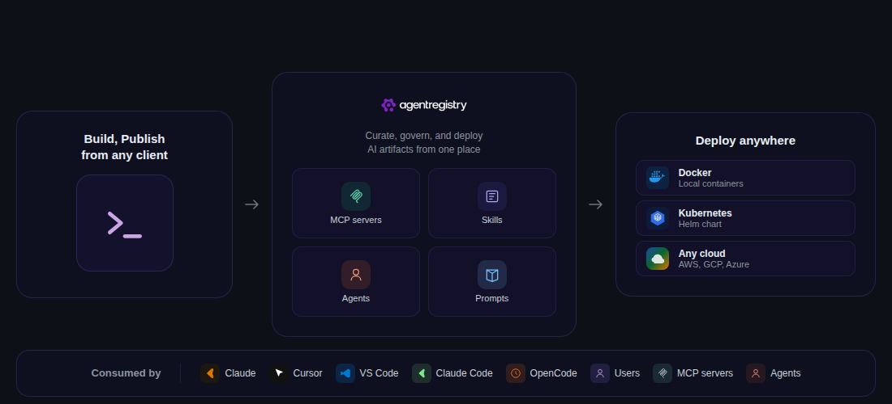
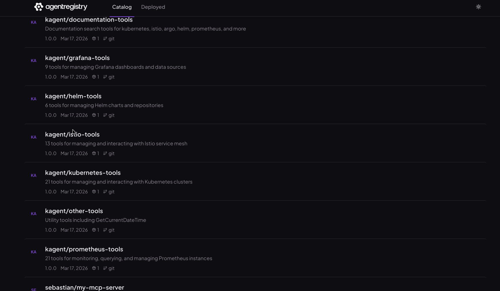
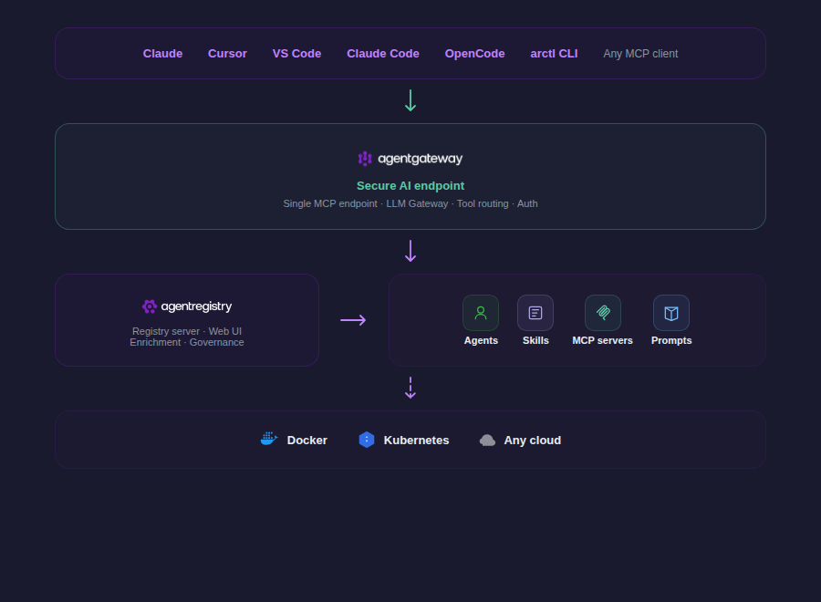

<p align="center">
  <picture>
    <source media="(prefers-color-scheme: dark)" srcset="docs/img/agentregistry-logo.png">
    <source media="(prefers-color-scheme: light)" srcset="docs/img/agentgateway-logo-light.png">
    
  </picture>
</p>

<h1 align="center" style="font-size: 3em;">Build. Deploy. Discover.</h1>
<h3 align="center">One registry for MCP servers, agents, skills and prompts.</h3>

<br/>

<p align="center">
  <a href="https://github.com/agentregistry-dev/agentregistry/stargazers"></a>
  &nbsp;
  <a href="https://discord.gg/HTYNjF2y2t"></a>
  &nbsp;
  <a href="https://github.com/agentregistry-dev/agentregistry/releases"></a>
  &nbsp;
  <a href="LICENSE"></a>
  &nbsp;
  <a href="https://golang.org/doc/install"></a>
</p>

<p align="center">
  <a href="https://aregistry.ai">Website</a> · <a href="https://aregistry.ai/docs/">Docs</a> · <a href="https://discord.gg/HTYNjF2y2t">Discord</a> · <a href="https://github.com/agentregistry-dev/agentregistry">GitHub</a> · <a href="#quick-start">Quick Start</a>
</p>

---

## What is agentregistry?

agentregistry is an open-source platform that gives you one place to find, manage, and run MCP servers, AI agents, and skills.

Right now, the MCP servers and AI tools your team needs are spread across npm, PyPI, Docker Hub, GitHub repos, and random URLs. Nobody knows which ones are trustworthy, which versions work, or how to get them running. Every developer is doing their own manual Docker setup and IDE configuration.

agentregistry puts all of that into a single registry with a CLI and a web UI. You import or publish artifacts once, and then anyone on your team can discover them, deploy them with one command, and have their IDE automatically configured to use them.

---

## Why agentregistry?

- **One trusted source for AI building blocks** — a curated catalog instead of scattered repos, scripts, and one-off MCP setup
- **Faster developer onboarding** — discover approved artifacts quickly with less manual configuration
- **Consistent path from laptop to cluster** — same discovery and delivery workflow across local dev and Kubernetes
- **Governance without slowing teams down** — centralize curation and publishing without forcing each team to rebuild the process

<p align="center">
  
</p>

<table>
<tr>
<td width="50%" valign="top">
<h3>For Organizations</h3>
<p><strong>Curate &amp; Deploy</strong></p>
<p>Package, collect, and enrich AI artifacts from any source in a single centralized registry.</p>
<ul>
  <li><strong>Centralized Control</strong> - Package and collect AI artifacts from any source into a single registry</li>
  <li><strong>Security &amp; Governance</strong> - Curate and approve agents, servers, and skills before company-wide deployment</li>
  <li><strong>Enriched Metadata</strong> - Add context to help assess trustworthiness and security</li>
</ul>

</td>
<td width="50%" valign="top">
<h3>For Developers</h3>
<p><strong>Build &amp; Publish</strong></p>
<p>Build, test, publish, and deploy AI artifacts with minimal dependencies.</p>
<ul>
  <li><strong>Local Development</strong> - Create and test agents, skills, and MCP servers locally</li>
  <li><strong>Easy Publishing</strong> - Publish your artifacts to a registry with a single command</li>
  <li><strong>Pull &amp; Run Anywhere</strong> - Pull artifacts from the registry and run them in any environment instantly</li>
  <li><strong>Discover &amp; Consume</strong> - Find new artifacts to add to registry or optimize existing artifacts</li>
</ul>

</td>
</tr>
</table>

<a id="quick-start"></a>
## Quick Start

**Prerequisites:** Docker Desktop with Docker Compose v2+

```bash
# 1. Install the CLI
curl -fsSL https://raw.githubusercontent.com/agentregistry-dev/agentregistry/main/scripts/get-arctl | bash

# 2. Start the agentregistry daemon by running any arctl command, such as arctl version.
arctl version

# 3. Open the agentregistry UI in your browser. http://localhost:12121 The UI is automatically exposed on port 12121 on your local machine when you start the agentregistry daemon.
```

That's it. Your IDE now has access to the deployed server through the agentgateway.

---

## Core Capabilities

### Build

Create, scaffold, and publish the building blocks of your agentic infrastructure.

- **MCP servers** — Register servers from npm (`npx`), PyPI (`uvx`), OCI/Docker images, or remote HTTP/SSE endpoints. Each entry supports versioning, environment variables, package references, and automated quality scores.
- **Skills** — Build structured knowledge packages that extend what an agent knows. A skill is a `SKILL.md` bundled with code examples, docs, PDFs, and reference URLs. Scaffold with `arctl init skill`, package and push the image with `arctl build ./skill --push`, then register the skill record with `arctl apply -f skill.yaml`.
- **Agents** — Define agents that bundle an identity with dependencies: which MCP servers it needs, which skills it uses, and how it should be configured. Scaffold with `arctl init agent`, build and push the image with `arctl build ./agent --push`, then register the versioned agent record with `arctl apply -f agent.yaml`.
- **Prompts** — Create reusable instruction templates that define how an agent should behave in specific contexts. Version and store them alongside agents, skills, and servers so they're discoverable and shareable across your team.

### Web UI

A browser-based admin interface at `localhost:12121`. Browse the artifact catalog, add MCP servers, skills, and agents, review enrichment scores and metadata, manage deployments, and configure the registry — all without touching the CLI.

<p align="center">
  
</p>

### Registry

Curate a shared catalog of MCP servers, agents, skills, and prompts your teams can trust and reuse.

- Publish artifacts to a central registry from npm, PyPI, Docker, OCI, or remote endpoints
- Discover approved artifacts through the CLI, REST API, or web UI at `localhost:12121`
- Give teams a consistent source of truth across environments

### Curation and Governance

Turn a broad set of available AI artifacts into a collection your organization is willing to support.

- Organize what developers can discover and deploy
- Review enrichment scores, versioning, and environment variable requirements
- Standardize how artifacts are shared across teams
- Keep control of what gets published and promoted

### Deployment Workflows

Move from discovery to usage without reinventing the same delivery path for every team.

- Run workflows locally with `arctl`
- Deploy Agent Registry into Kubernetes with Helm
- Support local environments and shared platform environments from the same registry
- Build and push agents — blueprints bundle an agent with its MCP servers and skills into a single deployable unit

### Client and Gateway Integration

Make approved artifacts easier to consume from the tools developers already use.

- Generate configuration for Claude Desktop, Cursor, and VS Code
- Pair with agentgateway for a consistent access layer to deployed MCP infrastructure
- Reduce manual setup for AI clients and shared environments

### How It Works Together

1. Platform teams curate and publish approved MCP servers, agents, and skills in Agent Registry
2. Developers discover those artifacts through the web UI or `arctl`
3. Teams pull and deploy what they need in local environments or Kubernetes
4. AI clients and shared gateway infrastructure connect to approved artifacts through a consistent workflow

## Secure Access with agentgateway

agentregistry pairs with [agentgateway](https://github.com/agentgateway/agentgateway) to give you a single, secure entry point to all your deployed MCP servers and agents.

Instead of exposing every MCP server individually, agentgateway acts as an AI-native reverse proxy that sits in front of your entire agentic infrastructure:

- **Single endpoint** — AI clients (Claude Desktop, Cursor, VS Code) connect to one URL. The gateway routes each tool call to the correct backend MCP server.
- **Authentication & authorization** — Enforce identity and access policies before requests reach your MCP servers. Control who can call which tools. Supports JWT validation and on-behalf-of auth flows.
- **Centralized observability** — Log and monitor all agent-to-tool traffic in one place instead of instrumenting each server separately. Supports OTEL endpoints for traces, metrics, and logs.
- **Dynamic discovery** — Deploy a new MCP server through agentregistry and every connected client picks it up automatically — no reconfiguration needed.
- **LLM gateway** — agentgateway also acts as a unified gateway for LLM providers, giving you a single endpoint to route, manage, and secure access to multiple language models.
- **Transport flexibility** — Proxy across stdio, SSE, and streamable HTTP transports seamlessly.

<p align="center">
  
</p>

When you run `arctl apply -f deployment.yaml`, agentregistry automatically configures the gateway routing so your MCP servers are reachable through the secured proxy. Run `arctl configure cursor` to point your IDE at the gateway endpoint.

---

## Related Projects

| Project | Role |
|---|---|
| [agentgateway](https://github.com/agentgateway/agentgateway) | AI-native reverse proxy for MCP traffic |
| [kagent](https://github.com/kagent-dev/kagent) | Kubernetes-native AI agent platform |
| [kgateway](https://github.com/kgateway-dev/kgateway) | Cloud-native API gateway (Envoy + Gateway API) |
| [MCP Go SDK](https://github.com/modelcontextprotocol/go-sdk) | Go SDK for building MCP servers |
| [Model Context Protocol](https://modelcontextprotocol.io/) | The open standard for AI-to-tool communication |

---

## Community

### Communication channels

If you're interested in participating with the agentregistry community, come talk to us!

- We are available on [**Discord**](https://discord.gg/HTYNjF2y2t)
- To report security issues, please follow our [**vulnerability disclosure best practices**](https://github.com/agentregistry-dev/agentregistry/security)
- Find more information on the [**agentregistry website**](https://aregistry.ai)

### Community meetings

We do not yet have community meetings. [**Establishing these meetings**](https://github.com/agentregistry-dev/agentregistry/issues) is on our [**roadmap**](https://github.com/agentregistry-dev/agentregistry/issues). Please help us deliver this work by either commenting on the issue, or volunteering to establish the meetings.

### Contributing

See [`CONTRIBUTING.md`](CONTRIBUTING.md) for guidelines and [`DEVELOPMENT.md`](DEVELOPMENT.md) for architecture and local development setup.

[Report a bug](https://github.com/agentregistry-dev/agentregistry/issues) · [Suggest a feature](https://github.com/agentregistry-dev/agentregistry/discussions) · [Join Discord](https://discord.gg/HTYNjF2y2t)

## License

Apache 2.0 — see [`LICENSE`](LICENSE).
